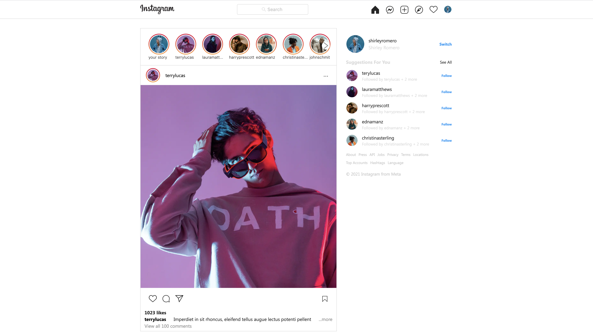
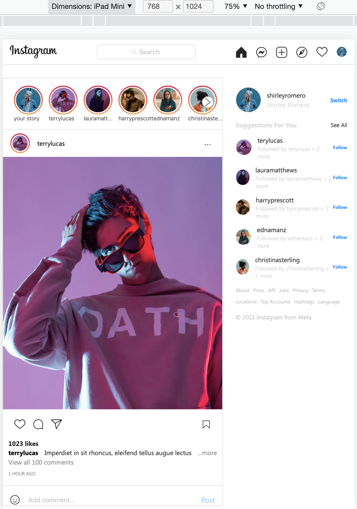
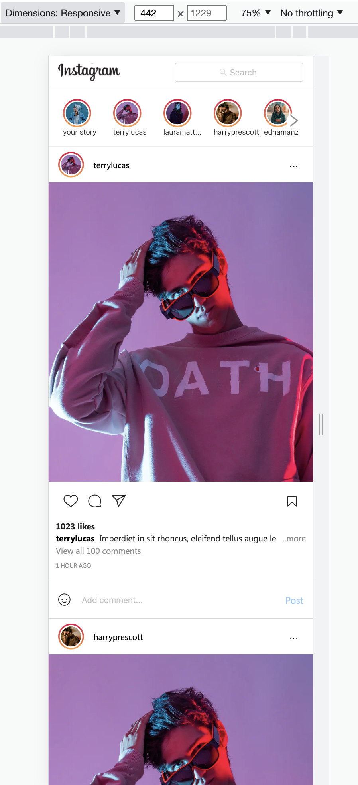

## Overview

This is a [project](https://insta-clone-drab.vercel.app/) that focus on the
development of the instagram home page UI design.

The solution was implemented using [Next.js](https://nextjs.org/) project
bootstrapped with
[`create-next-app`](https://github.com/vercel/next.js/tree/canary/packages/create-next-app).
The application also uses the [antd](https://ant.design/) and
[tailwindcss](https://tailwindcss.com/) framework for styling.

## Checkouts

The following features/interaction i implemented in this design.

- Added tooltip for all the Icon buttons,
- Implemented a show more feature that shows only a limited amount of
  characters,
- A like feature that increments the number of likes,
- A responsive design for mobile, tablet and desktop,
- I also made the number of carousel items responsive with the screen size.

## Responsiveness (desktop)

## Responsiveness (tablet)

## Responsiveness (desktop)

